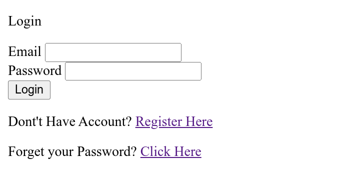

# Login Email

Sebulah projek yang dibuat tujuan belajar 
bagaimana user boleh dapat email jika register atau lupa password,
perlu dingat projek ini tidak sesuai untuk diletakkan di production 
kerana sengaja di tujuan awalnya hanya untuk mendapatkan email sahaja, 
dari segi keselamatan tidak ada keselamatan yang dibuat, 
bahkan password tidak di encrypt

## Gambaran projek
  

anda boleh cuba dengan clone project ini

Rename file `config.txt` kepada `config.php`, 
masukkan detail anda
```

$host = "";             // localhost
$user = "";             // database user
$pass = "";             // database password
$dbname = "";           // database name

// Set Time Zone
// refereren https://en.wikipedia.org/wiki/List_of_tz_database_time_zones 
$timeZone = "";   // Australia/Broken_Hill 


// on/off 
// true = sendemail
// false = email is not send
$sendEmail = false;

// Set detail email
$mailHost       = '';  //smtp.gmail.com
$mailUsername   = '';  //SMTP username
$mailPassword   = '';  //SMTP password
$mailPort       = 587;

//Recipients
$mailFromEmail = ""; // From email address
$mailFromName = ""; // From email name 
$mailSubject = ""; // Email Subject
```

masuk kedalam project dan jalankan composer
```
composer install && composer update
```
jalankan perintah dibawah untuk buat database dan table:
SQL
```
CREATE DATABASE login_email;

USE login_email;

CREATE TABLE IF NOT EXISTS users (
  user_id INT NOT NULL AUTO_INCREMENT,
  user_name varchar(100) DEFAULT NULL,
  user_email varchar(100) DEFAULT NULL,
  email_status varchar(100) DEFAULT NULL,
  password varchar(100) DEFAULT NULL,
  PRIMARY KEY (user_id)
);

CREATE TABLE IF NOT EXISTS verify (
  verify_email varchar(200) NOT NULL,
  verify_token varchar(200) NOT NULL,
  verify_expired timestamp NOT NULL,
  verify_action varchar(100) NOT NULL,
  PRIMARY KEY (verify_email)
) ;
```


